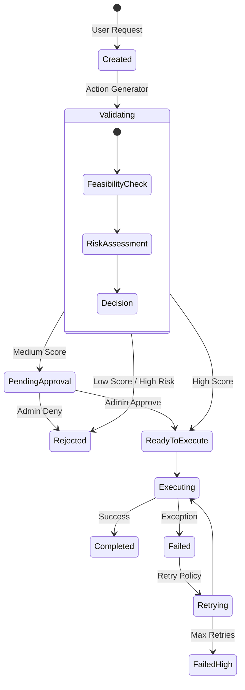
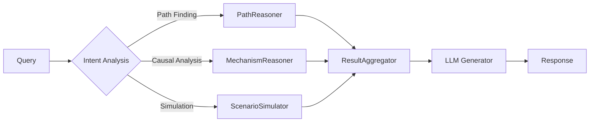

# v5.2 Final Ontology-Reasoning-Action System

**Technical Reference & Implementation Report**

> **"Reasoning beyond Retrieval"**
> 단순한 정보 검색(RAG)을 넘어, 데이터 간의 인과 관계를 추론(Reasoning)하고, 수학적 모델 기반으로 행동(Action)을 결정하는 자율형 에이전트 시스템입니다.

---

## 📚 Table of Contents

1.  [System Philosophy](#1-system-philosophy)
2.  [Core Logic & Algorithms (Deep Dive)](#2-core-logic--algorithms-deep-dive)
3.  [Data Schema Specification](#3-data-schema-specification)
4.  [State Diagrams & Lifecycle](#4-state-diagrams--lifecycle)
5.  [Error Handling & Reliability](#5-error-handling--reliability)
6.  [API Response Specification](#6-api-response-specification)
7.  [Versioning & Migration Strategy](#7-versioning--migration-strategy)
8.  [Security & Permissions](#8-security--permissions)
9.  [Installation & Deployment](#9-installation--deployment)

---

## 1. System Philosophy

본 시스템은 **"데이터가 구조화되고(Ontology), 연결되어 추론되며(Reasoning), 검증된 후 실행된다(Action)"**는 철학을 바탕으로 구축되었습니다.

---

## 2. Core Logic & Algorithms (Deep Dive)

v5.2 시스템의 핵심은 다음 8가지 수학적/논리적 메커니즘에 의해 구동됩니다.

### 2.1. Sign Propagation (Causal Logic)
*모듈: `src/reasoning/mechanism_reasoner.py`*

단순 연관성이 아닌, **변화의 방향성**을 추론합니다.
A가 B를 증가시키고($+$), B가 C를 감소시킨다면($-$), A는 C를 감소시킵니다($-$).

> $$ Sign_{total} = \prod_{i=1}^{n} Sign(edge_i) $$

*   $(+) \times (+) \rightarrow (+)$: 긍정적 강화
*   $(+) \times (-) \rightarrow (-)$: 억제 효과
*   $(-) \times (-) \rightarrow (+)$: 이중 부정 (억제의 억제는 강화)

### 2.2. Bayesian Evidence Accumulation
*모듈: `src/domain/relations.py`*

동일한 관계에 대해 여러 정보 출처(Evidence)가 발견될수록 신뢰도(Confidence)는 상승합니다.
이를 **Bayesian OR Gate** 방식으로 모델링하여, 증거가 쌓일수록 1.0(확실)에 수렴하도록 설계했습니다.

> $$ C_{final} = 0.8 \times \left( 1 - \prod_{i} (1 - c_{evidence\_i}) \right) + 0.2 \times S_{source} $$

### 2.3. Scenario Simulation with Convergence
*모듈: `src/reasoning/scenario_simulator.py`*

특정 엔티티에 충격($\Delta$)을 가했을 때, 전체 시스템에 미치는 파급 효과를 계산합니다.
발산(Explosion)과 무한 루프를 방지하기 위해 **감쇠(Damping)**와 **수렴(Convergence)** 알고리즘을 적용합니다.

> $$ V_{next}(e) = V_{curr}(e) + \sum_{neighbor} \left( V(neighbor) \times Sign \times Conf \times \lambda \right) $$

*   $\lambda$ (Damping Factor): 0.8
*   **Oscillation Detection**: 값의 부호가 반복적으로 바뀌면(진동), $\lambda$를 0.5로 강제 낮춰 수렴을 유도합니다.

### 2.4. BFS Path Reasoner with Decay
*모듈: `src/reasoning/path_reasoner.py`*

두 엔티티 간의 최적 설명 경로를 찾습니다.
경로가 길어질수록 추론의 설득력이 떨어지므로, **거리 기반 감쇠(Decay)**를 적용합니다.

> $$ Score_{path} = \left( \prod_{edge \in Path} Conf(edge) \right) \times 0.92^{(length - 1)} $$

### 2.5. Action Validator 4-Factor Scoring
*모듈: `src/actions/action_validator.py`*

생성된 행동(Action)을 실행하기 전, 4가지 관점에서 적합성 점수($F$)를 산출합니다.
$F \ge 0.8$이어야 자동 실행(`AUTO_EXECUTE`)됩니다.

> $$ F = 0.4(D) + 0.2(R) + 0.2(C) + 0.2(1 - K) $$

1.  **$D$ (Data Readiness)**: 필수 파라미터 충족률
2.  **$R$ (Resource Availability)**: API/DB 가용성
3.  **$C$ (Reasoning Confidence)**: 행동 근거의 논리적 확실성
4.  **$K$ (Risk Level)**: 행동의 위험도 (Side-effect 가능성)

### 2.6. RL Safety Clamp (15% Limit)
*모듈: `src/services/consistency_manager.py`*

강화학습(RL) 파라미터 업데이트 시,급격한 변화로 인한 시스템 불안정을 막습니다.

> $$ \Delta \theta_{safe} = \text{clip}(\Delta \theta, -0.15 \cdot \theta, +0.15 \cdot \theta) $$

### 2.7. Conflict Freeze Logic
*모듈: `src/services/consistency_manager.py`*

온톨로지 그래프 내에 논리적 모순이 감지되면, 학습을 즉시 중단하여 오염 확산을 막습니다.
*   **Threshold**: 전체 관계 대비 모순 관계 비율이 **3%**를 초과하면 `ValidationStatus.FREEZE` 발동.

### 2.8. Graph Hygiene (Degree Pruning)
*모듈: `src/services/consistency_manager.py`*

특정 엔티티에 연결이 과도하게 집중되는 **헤어볼(Hairball) 현상**을 방지합니다.
*   **Limit**: 단일 엔티티의 Degree > 40
*   **Action**: 신뢰도($Conf$) 하위 20% 관계 자동 가지치기(Pruning).

---

## 3. Data Schema Specification

시스템의 핵심 데이터 모델 정의입니다.

### 3.1. Entity Schema
`src/domain/entities.py`

| Field | Type | Description | Constraints |
| :--- | :--- | :--- | :--- |
| `id` | UUID | 고유 식별자 | Immutable |
| `canonical_name` | String | 대표 이름 (정규화됨) | Unique Index |
| `aliases` | List[Str] | 동의어 및 이명 | |
| `entity_type` | Enum | 엔티티 유형 | Concept, Event, Organization, Person... |
| `stability_score` | Float | 정보 안정성 점수 (0~1) | $\uparrow$ 정적 정보, $\downarrow$ 동적 정보 |
| `embedding` | Vector | 768-dim Vector | |

### 3.2. Relation Schema
`src/domain/relations.py`

| Field | Type | Description | Constraints |
| :--- | :--- | :--- | :--- |
| `source_id` | UUID | 시작 엔티티 ID | Foreign Key |
| `target_id` | UUID | 대상 엔티티 ID | Foreign Key |
| `relation_type` | Enum | 관계 유형 | IsA, PartOf, Causes, Correlates... |
| `sign` | Int | 영향 방향 | $\{+1, 0, -1\}$ (필수) |
| `confidence` | Float | 신뢰도 (0~1) | Bayesian Update 적용 |
| `evidence_list` | List[Ref] | 증거 출처 목록 | |

### 3.3. Action Schema
`src/domain/actions.py`

| Field | Type | Description |
| :--- | :--- | :--- |
| `action_type` | Enum | Retrieve, Reason, Execute, Workflow, Update |
| `parameters` | Dict | 실행에 필요한 인자 (JSON) |
| `status` | Enum | Created, Validated, Executing, Completed, Failed |
| `risk_level` | Float | 위험도 점수 (0~1) |
| `trace_log` | List | 실행 단계별 로그 |

---

## 4. State Diagrams & Lifecycle

시스템의 주요 상태 전이 다이어그램입니다.

### 4.1. Action Lifecycle



### 4.2. Reasoning Pipeline



---

## 5. Error Handling & Reliability

시스템은 4가지 레벨로 에러를 관리합니다.

### 5.1. Error Levels

| Level | Description | Handling Strategy |
| :--- | :--- | :--- |
| **L1: Transient** | 일시적 네트워크/API 오류 | `Retry` (Exponential Backoff, max 3회) |
| **L2: Logic** | 잘못된 파라미터, 데이터 없음 | `Fallback` (기본값 사용 또는 대체 경로 탐색) |
| **L3: Consistency** | 온톨로지 모순, RL 발산 | `Freeze` (학습 중단), `Rollback` (이전 체크포인트 복구) |
| **L4: Critical** | DB 손상, 보안 위협 | `Shutdown` (안전 모드 전환), Admin Alert 발생 |

### 5.2. Fallback Strategies
*   **LLM Unavailable**: Rule-based 템플릿 응답으로 대체.
*   **Reasoning Failed**: 단순 Vector Search(RAG) 결과 반환.
*   **Action Rejected**: 사용자에게 사유 설명 및 수동 실행 여부 확인 질문.

---

## 6. API Response Specification

API 응답 표준 포맷입니다. 모든 응답은 `metrics`와 `trace`를 포함하여 투명성을 보장합니다.

### POST `/api/ask` Response

```json
{
  "answer": "KTX 개통은 지방 거점 도시의 경제 활성화를 촉진합니다.",
  "confidence": 0.85,
  "sources": [
    { "entity": "KTX", "confidence": 0.95 },
    { "entity": "지역경제", "confidence": 0.88 }
  ],
  "reasoning_trace": [
    "Step 1: KTX -> (Causes, +) -> 접근성 향상",
    "Step 2: 접근성 향상 -> (Correlates, +) -> 유동인구 증가",
    "Step 3: 유동인구 증가 -> (Causes, +) -> 지역경제 활성화"
  ],
  "action_suggested": {
    "type": "workflow",
    "name": "Analyze_Regional_Impact",
    "status": "auto_execute"
  },
  "metrics": {
    "latency_ms": 420,
    "tokens_used": 150,
    "model": "llama3.2"
  }
}
```

---

## 7. Versioning & Migration Strategy

### 7.1. Ontology Versioning
*   **Snapshot**: 매일 자정 온톨로지 전체 스냅샷 저장 (`/snapshots/YYYY-MM-DD.db`).
*   **Delta Log**: 모든 변경 사항(Entity 추가, Relation 변경)은 `Transaction Log`에 기록되어 시점 복구(PITR) 지원.

### 7.2. Migration Policy
새로운 스키마(v5.3 등) 도입 시:
1.  **Dual Write**: 구버전과 신버전 테이블에 동시에 기록.
2.  **Background Migration**: 백그라운드 워커가 구버전 데이터를 변환하여 신버전으로 이동.
3.  **Validation**: 샘플 데이터 정합성 검증 (`ConsistencyManager`).
4.  **Switch Over**: 읽기 경로를 신버전으로 변경.

---

## 8. Security & Permissions

### 8.1. Action Permission Model (RBAC)

행동(Action)은 위험도에 따라 3등급으로 분류되며, 권한이 통제됩니다.

| Risk Level | Required Role | Examples |
| :--- | :--- | :--- |
| **Level 1 (Safe)** | `User` | 단순 조회(Retrieve), 계산(Reason), 시뮬레이션 |
| **Level 2 (Moderate)** | `Power User` | 데이터 업데이트, 외부 API 호출 (Read-only) |
| **Level 3 (Critical)** | `Admin` | 시스템 설정 변경, 결제 실행, 외부 API (Write) |

### 8.2. Security Filters
*   **Prompt Injection Defense**: 입력값에 시스템 프롬프트 무력화 시도가 있는지 검사 (`InputValidator`).
*   **PII Masking**: 출력 결과에 개인정보(전화번호, 이메일 등)가 포함되면 자동 마스킹.

---

## 9. Installation & Deployment

```bash
# 1. Clone & Setup
git clone [repository_url]
python -m venv venv
source venv/bin/activate
pip install -r requirements.txt

# 2. Configure
cp .env.example .env

# 3. Run Server
python -m api.app
```

---

<div align="center">
  <sub>v5.2 Final Release • 2025.12.10</sub>
</div>
